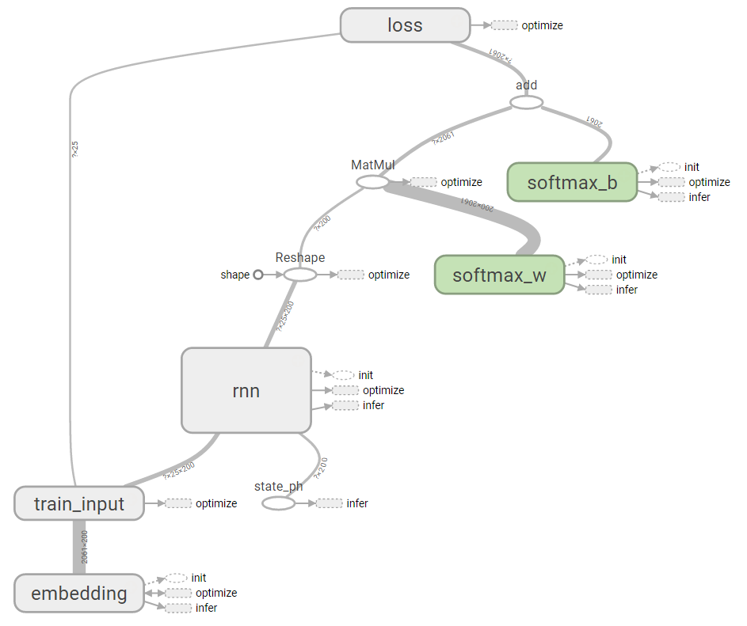

# tf_rnn_tutorial
TensorFlow tutorial for recurrent neural network

## Tutorial 1 - Minimal RNN Language Model

file: tf-rnn-tutorial1.py

This model learns from a plane text and produces imitating pseudo-text.
The tutorial uses the following TensorFlow functions.
 - tf.nn.dynamic_rnn()
 - tf.contrib.rnn.BasicLSTMCell()
 
This example shows how to feed 'initial_state' of tf.nn.dynamic_rnn() through TensorFlow's placeholders.

## Tutorial 2 - Using Summary

file: tf-rnn-tutorial2.py

This tutorial explains how to use summary write and summary operations to
visualize your execution on TensorBoard.

